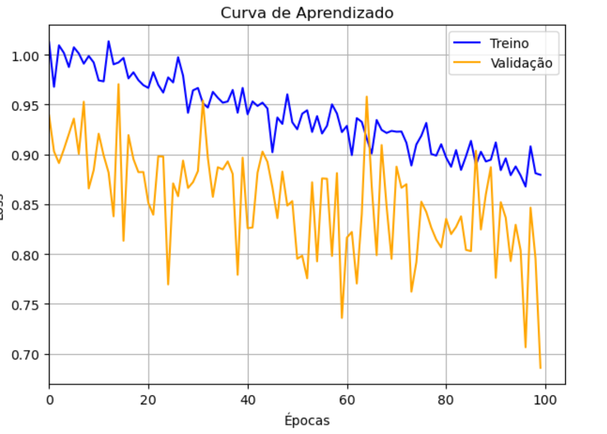

<div align="center">
  
</div

<h1 align="center">Oh no, I´m falling in dropout again 📉:</h1>

<h3 align="center">Implementação de Dropout em uma MLP feita em Python puro</h3>

<p align="center"><strong>Autoras:</strong> Júlia Guedes A. dos Santos e Maria Emily Nayla Gomes da Silva</p>
<p align="center"><strong>Orientador:</strong> Prof. Dr. Daniel R. Cassar</p>

<p align="center">

</p>


## 📝 Descrição
<p align="justify">
Neste projeto, nosso objetivo foi implementar o regularizador <em>dropout</em> em uma MLP desenvolvida em Python puro. Além disso, implementamos, em outro notebook, a estratégia de <em>Monte Carlo Dropout</em>, bem como a computação da incerteza nas previsões. Na primeira parte do projeto, propusemo-nos a evitar o overfitting da MLP zerando aleatoriamente alguns neurônios com base em uma variável <strong>P</strong>, que representa a probabilidade (entre 0 e 1) de um neurônio ser desativado. Dessa forma, a cada iteração, sorteamos um valor entre 0 e 1 e, caso esse valor seja menor que <strong>P</strong>, o neurônio é zerado. Caso contrário, ele permanece ativo e segue normalmente o fluxo de computação.
</p>


## 📔 Notebooks e arquivos do projeto
* `Imagens`: Pasta contento figuras utilizadas no README e o código para gerar a imagem de visualização do *dataset*.
  - `logos_Ilum-CNPEM.jpg`: logotipos da institução na qual tal projeto foi realizado e seus vínculos.
* `README.md`: descrição geral do projeto.


## 🗂️ Dataset - Breast Cancer Dataset (Kaggle)
<p align="justify">
  O dataset utilizado para testar o desempenho do regularizador <em>dropout</em> foi o <em>Breast Cancer Dataset</em>, encontrado no site <em>Kaggle</em>. 
  Nesse dataset, o target escolhido é uma variável nominal que indica o tipo de tumor do paciente, ou seja, se o tumor é benigno (B) ou maligno (M).
</p>

<div align="center">

| Colunas              | Descrição                                                                                      |
|----------------------|-----------------------------------------------------------------------------------------------|
| `id`                 | Identificação do paciente                                                                      |
| `diagnosis`          | Target; classificação do tumor em benigno e maligno                                             |
| `radius_mean`        | Raio dos lóbulos das mamas                                                                      |
| `texture_mean`       | Média da textura da superfície                                                                  |
| `perimeter_mean`     | Perímetro externo do lóbulo                                                                    |
| `area_mean`          | Área média do lóbulo                                                                            |
| `smoothness_mean`    | Média da suavidade dos contornos                                                                |
| `compactness_mean`   | Média da compacidade                                                                            |
| `concavity_mean`     | Média da concavidade (profundidade das regiões côncavas dos contornos)                         |
| `concavity_points`   | Média da quantidade de pontos de concavidade nos contornos                                      |

</div>


## 🏋️‍♀️ Implementando o dropout
<p align="justify">
A seguir, é possível observar as classes modificadas na MLP utilizada como referência. Com a MLP implementada em Python puro, sabíamos que era necessário criar um mecanismo para zerar gradientes aleatoriamente, levando em conta uma probabilidade previamente definida — ou seja, um hiperparâmetro utilizado para definir como a rede neural será regularizada. Dessa modo, estaríamos implementando o regularizador <em>dropout</em> em nossa rede, atuando para evitar o overfitting no modelo que estávamos desenvolvendo.
</p>

<p> </p>

### 🪴 Modificações no código 
#### 🌱 No momento de intanciar a MLP
<p align="justify">
  Nesta primeira célula, definimos o hiperparâmetro <em>P</em> e instanciamos a variável <strong>minha_mlp</strong> com os seguintes argumentos: <em>NUM_DADOS_DE_ENTRADA</em> — a dimensão dos dados do dataset de treino; <em>arquitetura_da_rede</em> — uma lista que informa a quantidade de neurônios em cada camada oculta; e o próprio <em>P</em>.
</p>

```python
P = 0.2
minha_mlp = MLP(NUM_DADOS_DE_ENTRADA, arquitetura_da_rede, P)
```

#### 🌱 Na classe MLP
<p align="justify">
Na célula seguinte, que é a parte de interesse para o comentário sobre as modificações na classe MLP, criamos a lista <em>camadas</em> como anteriormente. No entanto, para as camadas de entrada e de saída, instanciamos a variável <em>camada</em> com um parâmetro adicional, que serve para indicar que essas camadas não devem passar pelo <em>dropout</em>.
</p>

```python
class MLP:
    def __init__(self, num_dados_entrada, num_neuronios_por_camada, dropout_p = 0):
        percurso = [num_dados_entrada] + num_neuronios_por_camada
        
        camadas = []
        tamanho = len(num_neuronios_por_camada)
        for i in range(tamanho):
            if i == 0 or i == tamanho-1:
                camada = Camada(num_neuronios_por_camada[i], percurso[i], self.dropout_p)
            else:
                camada = Camada(num_neuronios_por_camada[i], percurso[i], self.dropout_p, 1) # Quando é uma camada de entrada ou de saída
            camadas.append(camada)
            
        self.camadas = camadas
```
#### 🌱 Na classe Camada
<p align="justify">
Na classe <em>MLP</em>, a variável <em>camada_visivel</em> indica se está sendo instanciada uma camada oculta ou uma camada visível (entrada ou saída).  Caso seja uma camada de entrada ou de saída, indicada por <em>camada_visivel = 1</em>, nenhum neurônio será zerado, ou seja, essa camada não passará pelo <em>dropout</em>.</p>


```python
class Camada:
    def __init__(self, num_neuronios, num_dados_entrada, dropout_p = 0, camada_visivel = 0):
        neuronios = []
        
        for _ in range(num_neuronios):
            neuronio = Neuronio(num_dados_entrada)
            neuronios.append(neuronio)
            
        self.neuronios = neuronios
        self.dropout_p = dropout_p
        self.camada_visivel = camada_visivel
        
    def __call__(self, x):
        dados_de_saida = []
        
        for neuronio in self.neuronios:
            # Caso não seja uma camada visível e o random.random() seja menor que a probabilidade P
            if self.camada_visivel == 0 and random.random() < self.dropout_p: 
                informacao = Valor(0)
            else:
                informacao = neuronio(x)
            dados_de_saida.append(informacao)
            
        if len(dados_de_saida) == 1:
            return dados_de_saida[0]
        else:        
            return dados_de_saida 
```


## 🔢 Resultados obtidos
<p align="justify"> A curva de aprendizado foi um dos métodos que utilizamos tanto para avaliar o quanto o modelo estava aprendendo durante as épocas quanto para verificar se o regularizador avaliado — o dropout — estava sendo efetivo na generalização da rede. Ao conseguir generalizar a rede, haveria uma piora na perda do treino e uma diminuição da perda dos dados de validação. Como esperado, houve queda na loss, e a dos dados de validação foi menor do que a dos dados de treino, o que nos levou a inferir que o regularizador foi implementado com sucesso. Contudo, como a acurácia encontrada foi de $64,91\%$, a mesma do modelo Dummy, concluímos que ainda não encontramos a melhor estratégia para lidar com os dados do notebook.
</p>

## 😁 Conclusão
<p align="justify">
Ao final, como esperado a partir da implementação do regularizador Dropout, os dados de validação apresentaram melhor desempenho em comparação aos dados de treino. No entanto, a acurácia encontrada para a rede treinada foi igual a de um modelo Dummy, o que pode significar que a estrutura não foi complexa o suficiente para encontrar parâmetros robustos que pudessem capturar a complexidade dos dados. Portanto, tem-se que apesar da implementação bem-sucedida do dropout, foi possível concluir que essa estratégia não foi eficaz para o dados utilizados no notebook.
</p>
<div align="center">
  
</div>

## 🖇️ Informações técnicas
* Linguagem de programação: `Python 3.9`
* Software:  `Jupyter Notebook`
* Bibliotecas e Módulos: `zipfile`,`Random`, `Matplotlib`, `os`, `Pandas`, `Math`, `scikit-learn`
<br>

## 👩‍🦳 Referências
[1] DropOut Layer. NumPyNet. Disponível em: <https://nico-curti.github.io/NumPyNet/NumPyNet/layers/dropout_layer.html>. Acesso em: 19 abr. 2025.
 
[2] DSA, Equipe. Capítulo 23 - Como Funciona o Dropout? Deep Learning Book. Disponível em: <https://www.deeplearningbook.com.br/capitulo-23-como-funciona-o-dropout/>. Acesso em: 19 abr. 2025.
 
[3] Referência Principal (construção da rede neural em Python puro): Andrej Karpathy. The spelled-out intro to neural networks and backpropagation: building micrograd (2022). https://www.youtube.com/watch?v=VMj-3S1tku0


## 🧠 Contribuições dos Colaboradores
| [<br><sub>Julia Guedes A. Santos</sub>](https://github.com/JuliaGuedesASantos)<br> [<sub>Ilum - CNPEM</sub>](https://ilum.cnpem.br/)<br> [<sub>Currículo Lattes</sub>](https://lattes.cnpq.br/9504021537643847)<br> [<sub>Linkedin</sub>](https://www.linkedin.com/in/j%C3%BAlia-guedes-546542283/) | [<br><sub> Maria Emily Nayla</sub>](https://github.com/MEmilyGomes)<br> [<sub>Ilum - CNPEM</sub>](https://ilum.cnpem.br/)<br> [<sub>Currículo Lattes</sub>](http://lattes.cnpq.br/9482558334105708)<br> | [<br> <sub> Prof. Dr. Daniel R. Cassar </sub>](https://github.com/drcassar)<br> [<sub>Ilum - CNPEM</sub>](https://ilum.cnpem.br/)<br> [<sub>Currículo Lattes</sub>](http://lattes.cnpq.br/1717397276752482) | 
| :---: | :---: | :---: | 

#### Para o Projeto:
* Emily Gomes: Implementação do dropout em uma MLP em Python puro.
* Júlia Guedes: Implementação do dropout em uma MLP em Python puro e comentário do código.

#### Para o Repositório GitHub:
* Emily Gomes: README
* Júlia Guede: 

**Orientação:** Prof. Dr. Daniel R. Cassar.


